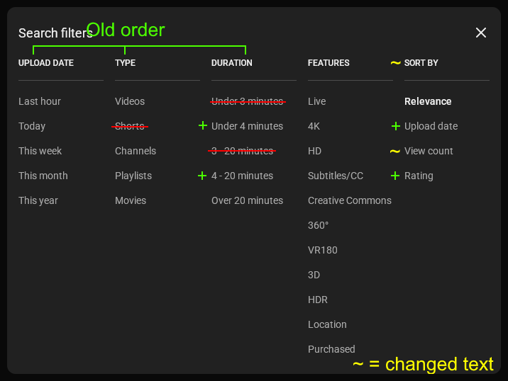
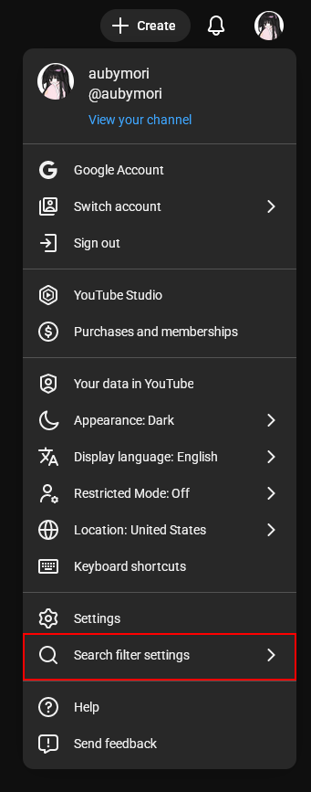

# Restore YouTube Search Filters
This userscript restores missing YouTube search filters such as Upload date and Rating while
also making some other changes to restore old behavior.



## Full feature list
- Restore the "Last hour" filter in the "Upload date" group.
- Re-order the groups to match the old order.
- Remove the "Shorts" filter from the "Type" group.
- Restore the "Under 4 minutes" and "4 - 20 minutes" filters in the "Duration" group.
- Remove the "Under 3 minutes" and "3 - 20 minutes" filters in the "Duration" group.
- Rename the "Prioritize" group back to "Sort by".
- Restore the "Upload date" filter in the "Sort by"/"Prioritize" group.
- Rename the "Popularity" filter back to "View count".
- Restore the "Rating" filter in the "Sort by"/"Prioritize" group.

## Configuring
Every aspect of the script is configurable. You can access the settings from your account
menu:



## Links
- [GreasyFork (script releases)](https://greasyfork.org/en/scripts/563980-restore-youtube-search-filters)

## Building

### Requirements

- NodeJS

### Steps

1. Clone the repository:
   ```bash
   git clone https://github.com/aubymori/restore-yt-search-params
   cd restore-yt-search-params
   ```
2. Install dependencies:
   ```
   npm i
   ```
3. Build.

   **For development**:
   ```bash
   ./esbuild dev
   ```

   **For production**:
   ```bash
   ./esbuild
   ```

   Windows users using the Command Prompt (not PowerShell or Bash) should substitute
   `./esbuild` for `.\esbuild`.